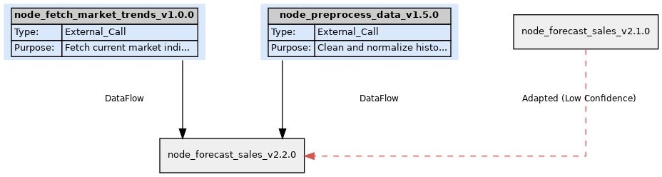

# Sentient Computational Manifold (SCM)

**A framework for building intelligent, adaptive, and self-evolving software systems.**

SCM represents a shift from traditional, brittle codebases to dynamic, machine-readable computation graphs. Logic, behavior, execution constraints, and adaptation strategies are encoded within self-describing JSON nodes, enabling systems that can validate, simulate, execute, observe, and even rewrite themselves.

---

## ⚡ Quick Start

Get up and running quickly:

```bash
# 1. Clone the repository (replace with your actual URL)
git clone https://github.com/pilothobs/Sentient-Computational-Manifold.git
cd Sentient-Computational-Manifold

# 2. Create virtual environment & install dependencies
python3 -m venv .venv
source .venv/bin/activate
pip install jsonschema rich semver graphviz # Add graphviz

# 3. Make tools executable
chmod +x tools/*.py

# 4. Run a simulation with agent control & tracing
# (This might trigger adaptation based on simulated performance)
./tools/scm.py agent-run scm/nodes/ --verbose --trace

# 5. View the trace report (find ID in the output above)
# ./tools/view_trace.py scm_traces/trace_<trace_id>.jsonl

# 6. View the adaptation history (if any occurred)
# ./tools/view_adaptations.py scm_traces/adaptation_log.jsonl

# 7. Visualize the graph (requires Graphviz system tools installed)
# ./tools/visualize_graph.py
# (Outputs scm_graph_visualization.gv and scm_graph_visualization.gv.png)
```

---

## ✨ Features

*   **Declarative Nodes:** Define computational units in JSON using a rigorous schema (`scm/schemas/scm_node.schema.json`), specifying metadata, dependencies, I/O contracts, execution logic, resilience policies, and adaptation strategies.
*   **Graph Composition:** Automatically build and validate executable Directed Acyclic Graphs (DAGs) from node dependencies (`scm/graph/`).
*   **Typed Execution:** Supports multiple execution types per node (`Model_Ref`, `External_Call`, `Subgraph_Ref`, etc.), currently simulated but designed for real implementation (`scm/runtime/`).
*   **Dynamic Model Loading:** Nodes of type `Model_Ref` dynamically load and execute corresponding Python modules from `scm/models/`, adhering to a defined interface.
*   **Agent-Driven Orchestration:** An intelligent agent monitors graph execution, evaluates risks, enforces policies, and can intervene based on runtime conditions (`scm/agents/`).
*   **Comprehensive Observability:** Detailed execution tracing (`scm_traces/`) captures events, inputs, outputs, metrics, and agent decisions for analysis (`scm/monitoring/`). Dedicated viewers (`scm/tools/`) provide human-readable reports.
*   **Adaptive Learning Loop:** Nodes can define adaptation strategies. Based on execution metrics (e.g., low confidence), the system can automatically trigger adaptations (currently simulated parameter adjustments) and perform **auto-versioning**, creating new node JSON files (`scm/adaptive/`).
*   **Unified CLI:** Interact with all core functionalities (validate, compose, simulate, agent-run, evaluate, view logs) via a central command-line tool (`scm/cli/`, `scm/tools/scm.py`).
*   **Graph Visualization:** Generate visual representations of the node graph, including dependencies and adaptation history (`scm/tools/visualize_graph.py`).

---

## 🏗️ Architecture Overview

SCM consists of several core modules:

1.  **Schema & Nodes (`schemas/`, `nodes/`)**: Defines the structure (`scm_node.schema.json`) and holds instances of SCM nodes (JSON files).
2.  **Graph (`graph/`)**: The `SCMGraphComposer` builds the executable DAG from nodes and determines the execution plan.
3.  **Runtime (`runtime/`)**: The `SCMExecutionEngine` executes individual nodes based on their `execution_logic`, handling dynamic loading for `Model_Ref` types and simulation for others. Includes simulation utilities.
4.  **Models (`models/`)**: Contains Python modules implementing the actual logic for `Model_Ref` nodes, adhering to the `run_model(inputs, params)` interface.
5.  **Agents (`agents/`)**: The `SCMAgentOrchestrator` oversees graph execution, performs checks, and calls the adaptation manager.
6.  **Monitoring (`monitoring/`)**: The `SCMTracer` manages trace sessions and logs detailed execution events.
7.  **Adaptive (`adaptive/`)**: The `AdaptationManager` evaluates adaptation triggers based on metrics and performs auto-versioning.
8.  **CLI & Tools (`cli/`, `tools/`)**: Provides user interfaces (main CLI, log viewers, visualizer).

```
scm-env/
└── scm/
    ├── schemas/          # SCM Node JSON Schema definition
    ├── nodes/            # Example SCM node instances (JSON)
    ├── models/           # Python modules for Model_Ref nodes
    ├── runtime/          # Core node execution engine and utilities
    ├── graph/            # Graph composer (DAG building, execution planning)
    ├── agents/           # Agent orchestrator (evaluation, controlled execution)
    ├── monitoring/       # Tracing and observability system
    ├── adaptive/         # Adaptation manager (trigger evaluation, auto-versioning)
    ├── cli/              # Main CLI command logic
    ├── tools/            # Helper scripts (CLI entrypoint, viewers, visualizer)
    ├── scm_traces/       # Default output dir for trace logs & adaptation log
    ├── .venv/            # Python virtual environment
    └── README.md         # This file
```

---

## 📊 Graph Visualization

*(This shows the current state of the example graph, including the adapted forecast node)*

```dot
// Example DOT representation snippet (Generated by visualize_graph.py)
digraph SCM_Graph {
	rankdir=TB
	splines=ortho
	nodesep=0.8
	ranksep=1.0
	node [shape=record style=filled fillcolor="#EFEFEF" fontname=Helvetica fontsize=10]
	edge [fontname=Helvetica fontsize=9]
	// ... nodes ...
	subgraph cluster_node_forecast_sales { ... }
	// ... edges ...
}
```

*(You can generate the actual graph image using `scm/tools/visualize_graph.py` - see Quick Start / Usage)*



*(The image above should render once the Graphviz tools are installed and visualize_graph.py is run)*

---

## 🤖 LLM-Ready by Design

SCM's declarative, machine-readable nature makes it ideal for interaction with Large Language Models (LLMs). Potential use cases include:

*   **Graph Comprehension:** LLMs can parse node definitions and graph structures to explain complex workflows.
*   **Node Generation:** Generate new SCM nodes based on high-level goals or natural language descriptions.
*   **Simulation & Analysis:** Use LLMs to simulate different scenarios or analyze trace logs for insights.
*   **Adaptation Suggestions:** Propose new adaptation strategies or parameter adjustments based on performance trends.

---

## 🔄 The Adaptation Loop Explained

SCM's ability to adapt is a key feature. Here's how the current loop works:

1.  **Node Definition:** An SCM node (e.g., `node_forecast_sales_v2.1.0`) defines an `adaptation_strategy`, specifying a `trigger` (e.g., `Performance_Degradation`), a relevant `metric_ref`, and an adaptation `method` (e.g., `Adjust_Parameters`).
2.  **Execution & Monitoring:** During execution (via `agent-run`), the `SCMExecutionEngine` runs the node and records metrics (like `simulated_confidence`) in the metadata.
3.  **Agent Orchestrator:** After successful node execution, the `SCMAgentOrchestrator` calls the `AdaptationManager`.
4.  **Trigger Evaluation:** The `AdaptationManager` (`adaptive/adaptation_manager.py`) checks if the trigger condition is met using the recorded execution metadata (e.g., is `simulated_confidence < PERFORMANCE_CONFIDENCE_THRESHOLD`?).
5.  **Adaptation Action (Simulated):** If triggered, the manager simulates the specified `method`. For `Adjust_Parameters`, it currently makes a *random* adjustment to one of the parameters defined in the node's `execution_logic`.
6.  **Auto-Versioning:** A new JSON file for the node is created (e.g., `node_forecast_sales_v2.2.0.json`). The `version` and `@id` fields are incremented (minor version bump), and metadata like `rationale`, `creation_timestamp`, `author_agent_ref`, and `derived_from` are updated.
7.  **Logging:** The adaptation event (trigger, method, versions, etc.) is recorded in the `adaptation_log.jsonl` file (viewable with `tools/view_adaptations.py`).

*Note: The next time the graph composer runs, it will typically pick up the latest valid version of each node (e.g., `v2.2.0`) for the execution plan.*

---

## 🛠️ Setup and Usage

**🧰 Minimum Requirements**

To run the SCM framework locally, your system should meet the following minimum specs:

*   **✅ Development Machine**
    *   CPU: 4 cores or higher (Intel i5/Ryzen 5 or better recommended)
    *   RAM: 8 GB minimum (16 GB recommended for running real models)
    *   Disk: ~1 GB free space (project + traces + models)
    *   Python: 3.10 or later
    *   Pip/venv: Installed and working
    *   Graphviz: Installed for graph rendering (optional but recommended)

*   **⚙️ Optional Enhancements**
    *   GPU (for real model training or heavy compute nodes in future)
    *   Docker (for isolating environments)
    *   VS Code or Cursor (for smooth dev experience)

*SCM runs on Linux, macOS, and Windows — though Linux (Ubuntu/Debian) is the most tested environment so far.*

**(Installation)**

```bash
# Clone repository (use your actual URL)
git clone https://github.com/pilothobs/Sentient-Computational-Manifold.git
cd Sentient-Computational-Manifold

# Create and activate virtual environment
python3 -m venv .venv
source .venv/bin/activate

# Install dependencies
pip install jsonschema rich semver graphviz

# Make tools executable
chmod +x tools/*.py
```

**(Core Commands - run from project root)**

*   **Validate a Node:**
    ```bash
    ./tools/scm.py validate scm/nodes/node_forecast_sales_v2.1.0.json
    ```
*   **Compose Graph & Show Plan:**
    ```bash
    ./tools/scm.py compose scm/nodes/
    ```
*   **Run Basic Simulation:** (No Agent, No Adaptation)
    ```bash
    # Add --trace to see trace file info
    ./tools/scm.py simulate scm/nodes/ --trace
    ```
*   **Run Agent-Controlled Simulation:** (Includes Adaptation)
    ```bash
    # Use -v for verbose logs
    ./tools/scm.py agent-run scm/nodes/ -v --trace
    ```
*   **Evaluate Graph Structure:** (Agent analysis only)
    ```bash
    ./tools/scm.py evaluate scm/nodes/
    ```
*   **View Execution Trace:** (Get `<trace_id>` from simulation output)
    ```bash
    ./tools/view_trace.py scm_traces/trace_<trace_id>.jsonl
    ```
*   **View Adaptation Log:**
    ```bash
    ./tools/view_adaptations.py scm_traces/adaptation_log.jsonl
    ```
*   **Generate Graph Visualization:**
    ```bash
    # Outputs scm_graph_visualization.gv and .png
    ./tools/visualize_graph.py
    # Specify output file: ./tools/visualize_graph.py -o my_graph_output
    ```

---

## 🗺️ Future Roadmap

This implementation provides a foundational proof-of-concept. Potential next steps include:

*   **Real Execution Logic:** Implement non-simulated logic for `External_Call` (actual API calls) and `Algorithm_Ref` (running defined algorithms).
*   **Real Data Passing:** Move beyond mock inputs/outputs; serialize/deserialize actual data structures between nodes based on `data_type_ref`.
*   **Sophisticated Adaptation:** Implement specific parameter adjustment logic, model retraining triggers, and potentially structural graph evolution methods.
*   **State Management:** Implement persistent state (`Stateful`, `Contextual`) using configurable backends (e.g., Redis, databases).
*   **Agent Intelligence:** Enhance the `SCMAgentOrchestrator` with more complex reasoning, goal orientation, and learning capabilities.
*   **Error Handling & Resilience:** Implement more robust `resilience_policy` actions (e.g., actual Retry, Fallback execution paths).
*   **Input Parameterization:** Allow passing external parameters (`source: external_parameter`) when invoking graph runs via the CLI.
*   **Testing:** Develop comprehensive unit and integration tests.
*   **Schema Evolution:** Define schemas for data types (`type_...`) and metrics (`metric_def_...`).

---

*This README provides an overview of the SCM framework.*
